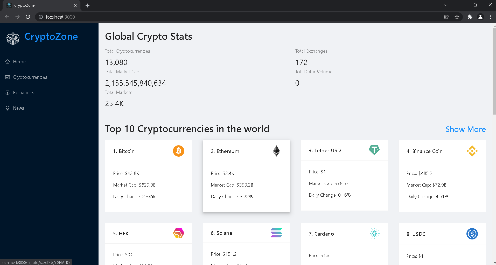
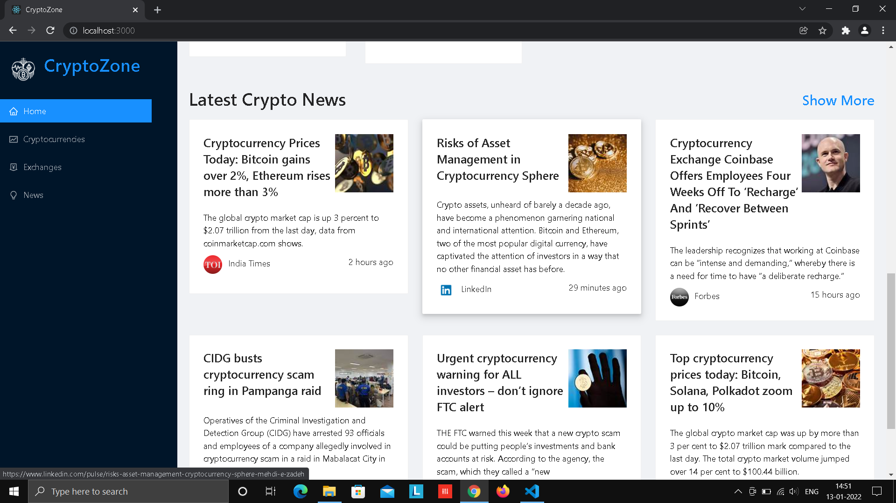
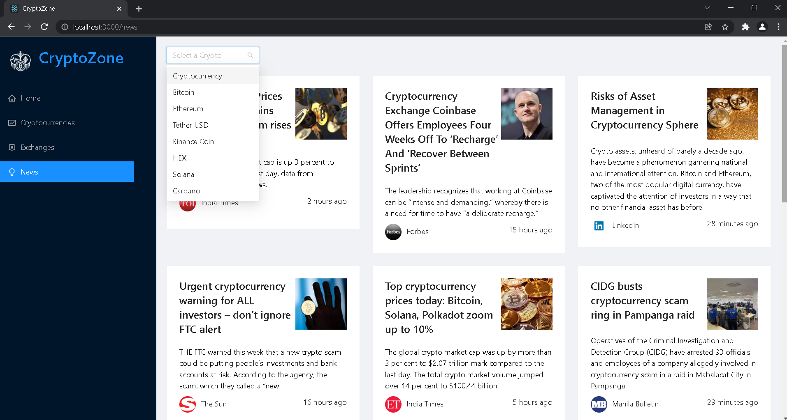
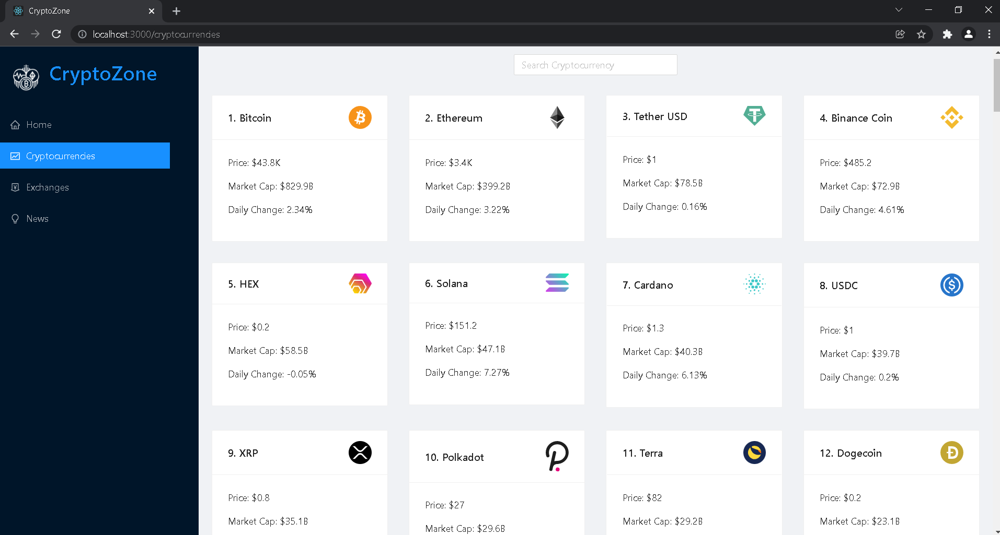
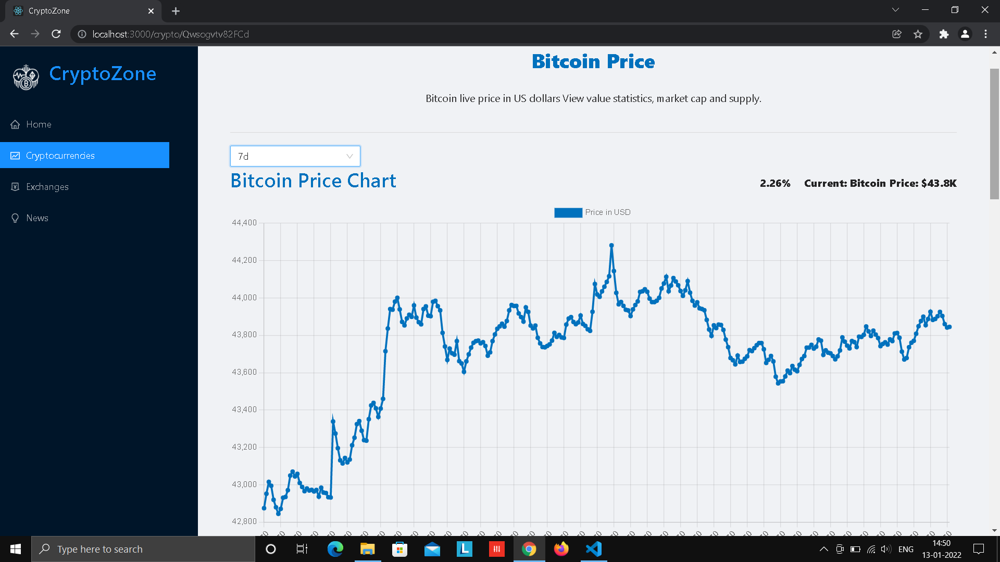
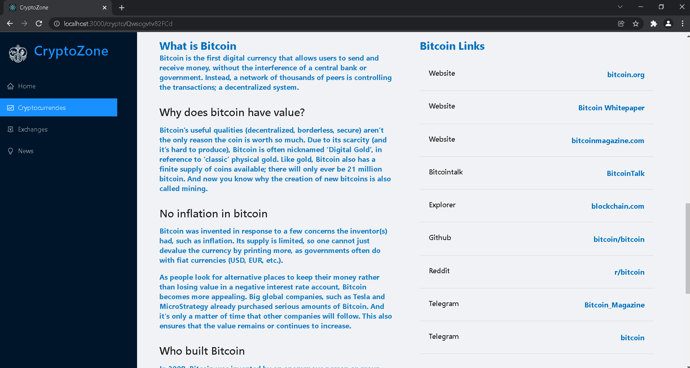

# CryptoZone: One website for all crypto needs. 
## Get latest news and track price history of the top 100 cryptocurrencies in the world. 
Used **React** with **ant design** to create the UI. Managed state and APIs with **redux toolkit**. Created links with **react-router-dom**. Used **react-chartjs-2** to create charts.
### [view website](https://mycryptozone.netlify.app)
### Home_page:

### News_page:

### Cryptocurrencies_page:

### Cryptodetails_page:

